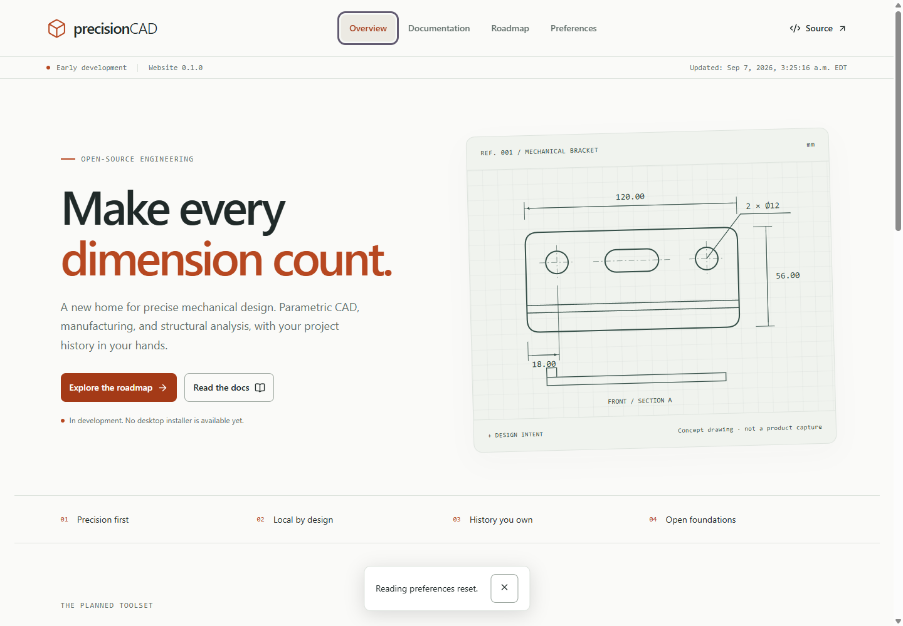

# Precision CAD

An open-source mechanical CAD, CAM, and structural-analysis application for Windows x64. **Development is in progress. There is no production-ready release yet.**

The product combines a native C++20/Qt desktop interface with Open CASCADE geometry, parametric documents, and local Git project history. The intended scope includes assemblies, associative drawings, sheet metal, 2.5D/three-axis milling, and linear static/modal analysis.

## Build

The supported entry point being implemented is:

```powershell
.\build.bat --run
```

Until the bootstrap and packaged application are verified, this command is not claimed to work on a fresh installation. See [ROADMAP.md](ROADMAP.md) and [HANDOFF.md](HANDOFF.md) for the actual delivery state.

## Documentation

- [Live project website](https://ding-ding-projects.github.io/precision-cad/)

- [Architecture](docs/engineering/architecture.md)
- [Feature documentation](docs/README.md)
- [Roadmap](ROADMAP.md)
- [Current implementation evidence](HANDOFF.md)

Source is intended for distribution under GPL-3.0-or-later. Third-party components retain their own licenses. This application does not command connected machinery or certify structural safety.

## Development surfaces

- [Delivery project](https://github.com/orgs/Ding-Ding-Projects/projects/36)
- [Discussions](https://github.com/Ding-Ding-Projects/precision-cad/discussions)
- [Issue tracker](https://github.com/Ding-Ding-Projects/precision-cad/issues)
- [Website build details](docs/engineering/build.md)

The current build produces the website only. No native CAD executable or installer exists yet.

## Website evidence

The following is a genuine capture of the built website at source `463040400b37c98e09ec4e89269699f9bc307fd8`, not a CAD application capture. The bracket drawing is an explicitly labelled concept illustration.



Follow [setup issue #1](https://github.com/Ding-Ding-Projects/precision-cad/issues/1), [the rolling progress discussion](https://github.com/Ding-Ding-Projects/precision-cad/discussions/2), and [the cross-surface feature contract](https://github.com/Ding-Ding-Projects/precision-cad/issues/3).
